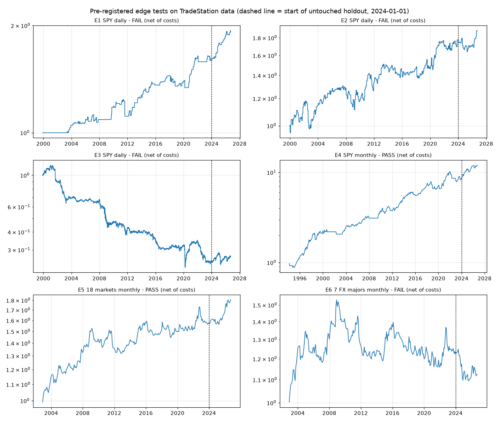

# Edge research: results

All price data comes from TradeStation `get-bars`: 20 symbols and 41,000+ bars, re-parsed with `tools/extract_bars.py`. There are no duplicate-bar conflicts, no OHLC violations and no missing months. The rules, cost assumptions, period splits and pass criteria were committed in `edge/PREREGISTRATION.md` (commit `23af677`) **before** any test was run. They were not changed afterwards. Nothing in this study uses random numbers.

Reproduce: `python -m edge.research`. It writes `edge/results/summary.json`, the trade and return CSVs and `equity.png`.

## Verdict

| id | edge | pre | post | holdout 2024-01..2026-09 | t | neighbours + | QQQ confirm | **result** |
|----|------|-----|------|------|---|---|---|---|
| E1 | RSI(2) pullback, SPY | +8.9% | +46.3% | +20.6% | 2.04 | 15/15 | net +116%, **t 1.15** | **FAIL** (QQQ t < 1.5) |
| E2 | Turn of month, SPY | +19.2% | +46.3% | +8.4% | **1.04** | 9/9 | t 0.50 | **FAIL** (t < 2) |
| E3 | Overnight drift, SPY | **-51.3%** | **-48.5%** | +8.0% | -1.10 | n/a | t -2.04 | **FAIL** (costs eat it) |
| E4 | 10-month SMA filter, SPY | +211% | +178% | +39.1% | 4.41 | n/a | n/a | **PASS** (but see below) |
| E5 | Time-series momentum, 18 markets | +32.6% | +18.6% | +14.7% | 2.34 | 3/3 | n/a | **PASS** |
| E6 | Time-series momentum, FX only | +22.7% | **-0.1%** | **-8.2%** | 0.51 | 3/3 | n/a | **FAIL** |

The pre, post and holdout columns are compounded net returns for each block, after costs. For E1-E3, t is the t-statistic of the in-position daily return minus SPY's unconditional daily mean. For E4-E6 it is the t-statistic of the mean monthly net return.

## What survived, and what it is really worth

**E5, multi-asset time-series momentum, is the only real edge in this set.** It passed every block and all three lookbacks (3, 6 and 12 months). It also stayed positive in the holdout, which nobody looked at beforehand.

The edge is small:
- Unlevered, it made **2.5% a year (CAGR)** at 5.5% volatility. That is a Sharpe ratio of 0.48, with a worst drawdown of -13.7% and 16 of 25 years positive.
- In the holdout it made about 5.1% a year.
- Scaled 2x, it would have made about 4.7% a year at 11% volatility with a -26.5% drawdown. Scaled 3x, about 6.7% a year with a -38% drawdown. The leverage levels were picked after seeing the results, so treat these as illustration only.
- It works only if you **don't pay CFD overnight financing**. With 3% a year of financing on the position size, the full-sample result drops to **-7.7%**. It would have to run on futures or cash ETFs, not on a CFD or spread-bet account.
- The gains come mainly from equity indices and gold (SPY, QQQ, EEM, EFA, GLD, DBC). FX added little, and E6 shows FX momentum alone has faded since 2012.

**E4, the 10-month SMA filter, passes the criterion I wrote, but that criterion was too easy.** Any mostly-long equity strategy clears "t ≥ 2 on the mean monthly return" in a rising market. Compared with simply holding SPY:
- It made 7.9% a year against buy-and-hold's 8.9%, both price-only.
- It **lagged** buy-and-hold in the post-publication block (+178% vs +225%) and in the holdout (+39% vs +62%).
- Its t-statistic against buy-and-hold is -0.78.
- What it actually delivers is **lower drawdowns**: the worst was -23.6% against -52.2% for SPY. It is a risk overlay, not a source of extra return.

**E1, the RSI(2) pullback, came close but failed.** It was positive in every block, all 15 parameter neighbours were positive, and its SPY t-statistic was 2.04. But it did not confirm on QQQ (t 1.15), and passing on QQQ was a pre-registered requirement. It cannot be promoted after the fact. It is in the market only about 10% of the time.

**E2 and E3 failed.** The turn-of-month effect is positive but not statistically distinguishable from just holding SPY. The overnight effect is real before costs (t 2.7 against zero), but it averages 2.3 bp a night. Paying 4 bp a day to capture it loses money.

## Limitations (these cut both ways)

- **ETF prices are split-adjusted but not dividend-adjusted.** Long ETF returns are understated by roughly 1.5-2.5% a year for equities and more for bonds. Short ETF returns are overstated, because a real short pays the dividends. Buy-and-hold is understated more than E4, because E4 is invested only 76% of the time.
- **FX returns are spot only.** They leave out the interest-rate differential (carry). The published time-series momentum results use futures, which include it.
- **Cash earns 0% in every test.** Real idle cash, and the margin backing futures, would earn T-bill interest.
- **The last bar is partial.** The 2026-09 bar and the last daily bar end on 2026-09-25.
- **One choice was not in the pre-registration:** E5 and E6 start only once at least 5 markets have signals (the portfolio starts 2002-11). Rebalancing costs are charged on changes in target weights and ignore drift between rebalances.

## Bottom line

On 20+ years of real data, **none of these edges supports the idea of a strategy that makes several percent a month.** The one robust edge, cross-asset trend following, makes low-to-mid single digits a year at moderate risk.

For a live account, the honest route is:
- Run E5 on futures (micro contracts) or as long-only ETFs held in cash. Optionally use E4 on the equity core to limit drawdowns.
- Paper-trade it on TradeStation for 3-6 months first.
- Size it so that a drawdown two to three times the historical worst would still be survivable.
