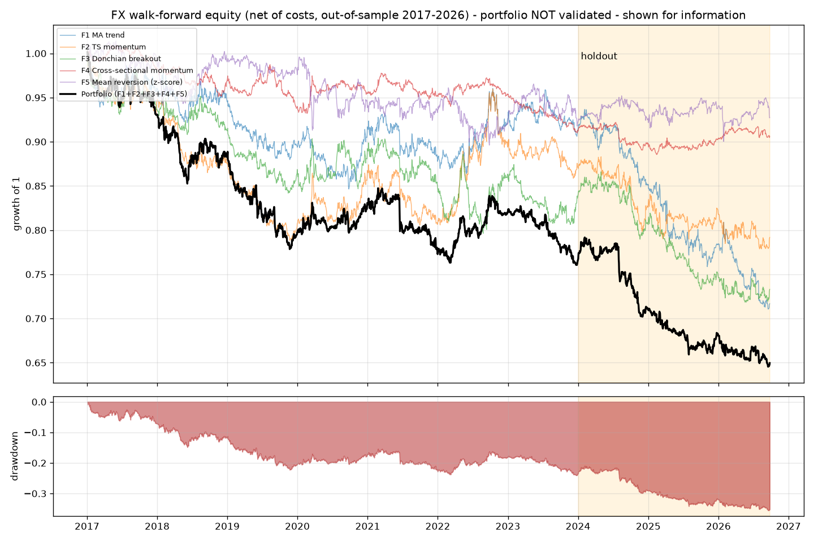
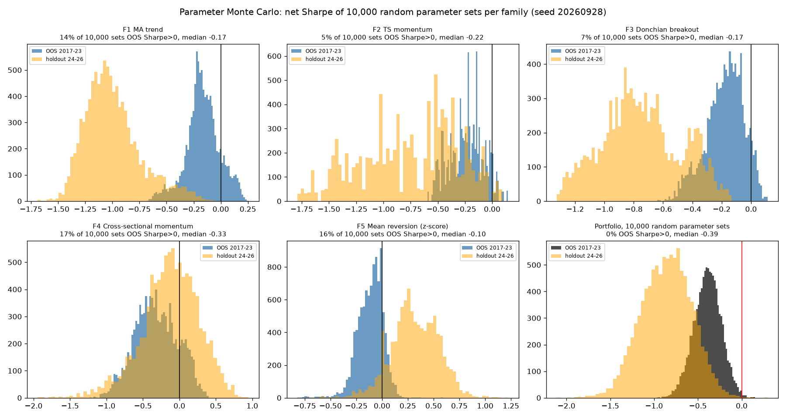
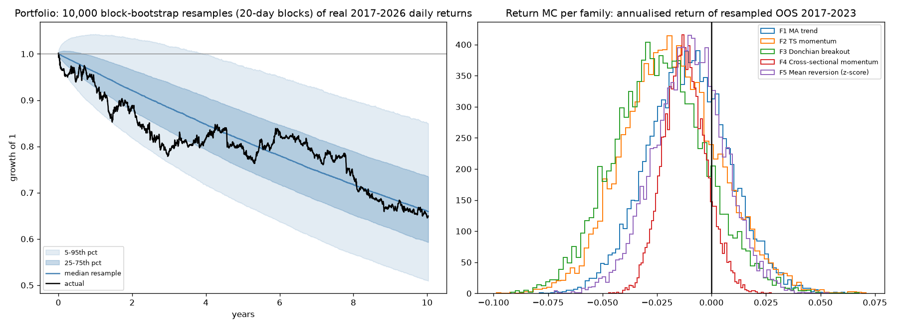

# FX strategy research: results

**Verdict: none of the five pre-registered FX strategy families passes validation.** All five lost money after costs in the 2017-2023 walk-forward out-of-sample period. The parameter Monte Carlo shows that no other parameter choice would have saved them. There is therefore **no tradable FX portfolio** from this study. The portfolio curve below shows what an equal-risk mix of all five would have done, and it lost money.

- **Data:** TradeStation `get-bars` daily bars for EURUSD, GBPUSD, USDJPY, AUDUSD, USDCAD, USDCHF and NZDUSD, from 2006-10-09 to 2026-09-25. That is 5,181 aligned days, with no gaps longer than 5 days. The bars are in `data/tradestation/*_daily.csv`.
- **Rules:** the rules, parameter ranges, costs, periods and pass criteria were committed in `edge/fx/PREREGISTRATION.md` (commit `ad11168`) **before the data was downloaded**. They were not changed afterwards.
- **Reproduce:** run `python -m edge.fx.research` (about 3 minutes). It writes `edge/fx/results/`.

## Where random numbers are used, and where they are not

Random numbers (seed 20260928) are used **only** in the two pre-registered Monte Carlo tests:

1. **Parameter Monte Carlo.** For each family, 10,000 parameter sets are drawn uniformly from the pre-registered ranges. Each set is then backtested on the **real** price history.
2. **Return Monte Carlo.** 10,000 moving-block bootstraps (20-day blocks) of the **real** realised daily net returns. This reshuffles returns that actually happened. It does not invent any.

No prices or returns are generated anywhere.

## Results per family

Every figure is net of costs. Costs are the spread plus 0.5 pip commission plus 0.4 pip slippage per round turn, charged on every change in position. Signals are computed on the close and filled at the next open. Each pair is sized to 10% annualised volatility, and the 7 pairs are averaged with equal risk.

| id | strategy | WF OOS 2017-23 Sharpe / ann. | param MC: sets with Sharpe>0 (median) | return MC P(loss) / 5th pct | dev 2008-16 Sharpe | holdout 2024-26 Sharpe / ann. | result |
|---|---|---|---|---|---|---|---|
| F1 | MA trend | -0.20 / -1.3% | 14.2% (-0.17) | 71% / -4.1% | +0.34 | -1.29 / -8.1% | **FAIL** |
| F2 | TS momentum | -0.28 / -1.9% | 5.2% (-0.22) | 80% / -5.2% | +0.17 | -0.54 / -3.3% | **FAIL** |
| F3 | Donchian breakout | -0.38 / -2.5% | 6.8% (-0.17) | 87% / -5.8% | +0.18 | -0.77 / -4.5% | **FAIL** |
| F4 | Cross-sectional momentum | -0.48 / -1.3% | 16.8% (-0.33) | 89% / -2.8% | +0.08 | -0.11 / -0.3% | **FAIL** |
| F5 | Mean reversion (z-score) | -0.20 / -1.1% | 15.9% (-0.10) | 74% / -3.7% | -0.04 | +0.09 / +0.3% | **FAIL** |

To pass, a family needed all four of the following. Every family failed criteria 1-3, and F5 also failed criterion 4.

1. Walk-forward out-of-sample Sharpe ≥ 0.3 with a positive return.
2. At least 60% of the 10,000 random parameter sets with an out-of-sample Sharpe above 0, and a median above 0.
3. Return Monte Carlo probability of a loss below 20%.
4. Development-period Sharpe above 0.

The parameters picked each January from the trailing 5 years are listed in `results/summary.json` under `chosen_params`.

### How to read this

- **The trend families (F1-F3) were mildly positive in 2008-2016 and negative afterwards.** They were positive in development for 83-92% of random parameter sets. From 2017 on, only 5-14% of sets were positive, and in the 2024-26 holdout essentially none were (0-1.7%). This matches the monthly E6 result in `edge/REPORT.md`: trend following on FX majors has not paid since the mid-2010s. The problem is not a bad parameter choice. The **whole distribution** of 10,000 parameter sets moved below zero.
- **Costs are not the reason.** Before costs, the reference parameter sets have out-of-sample Sharpe ratios of -0.56 to +0.01. The signals themselves had no edge.
- **Cross-sectional momentum (F4)** had nothing even in development (Sharpe +0.08, 52% of sets positive).
- **Mean reversion (F5)** is the only family positive in the holdout for most parameter sets: 90% of the 10,000 sets, median Sharpe +0.31. **This is not evidence of an edge.** It failed every pre-registered test on 2017-2023 and was slightly negative in 2008-2016. Only 2024-2026 favoured it. Promoting it now would be exactly the after-the-fact selection this process is designed to stop. If F5 is worth pursuing, it needs a new pre-registration and new data to test on.

## Portfolio (all five families, equal risk; NOT validated, shown for information)

Each family's walk-forward return stream is scaled to 10% volatility using its own trailing 60 days, then the five are averaged.

| period | ann. return | ann. vol | Sharpe | max drawdown | total |
|---|---|---|---|---|---|
| OOS 2017-2023 | -3.7% | 5.4% | -0.66 | -24.1% | -23.6% |
| Holdout 2024-01 to 2026-09-25 | -5.6% | 5.2% | -1.07 | -18.5% | -15.0% |
| **2017 to 2026-09 combined** | **-4.2%** | 5.4% | -0.78 | -35.5% | **-35.0%** |

- **Calendar years:** 2017 -6.9%, 2018 -5.2%, 2019 -9.6%, 2020 +4.0%, 2021 -6.8%, 2022 +6.0%, 2023 -6.8%, 2024 -6.9%, 2025 -4.3%, 2026 (to Sep 25) -4.6%.
- **With swap:** applying the -2% a year swap sensitivity to the average gross exposure (2.46x) takes the combined result to about **-9.1% a year**.

## Monte Carlo tests

**Parameter Monte Carlo on the portfolio.** I built 10,000 portfolios. Portfolio *i* combines random parameter set *i* from each family. Results:

- Only **0.4%** had an out-of-sample Sharpe above 0. The median Sharpe was -0.39.
- In the holdout, 0.1% were positive.
- Across the 10,000 portfolios, the 2017-2026 annualised return ranged from -4.4% (5th percentile) to -1.7% (95th percentile), with a median of -3.0%.

In short, no parameter choice makes this set of FX strategies profitable.

**Return Monte Carlo on the portfolio.** 10,000 block-bootstraps of the real 2017-2026 daily returns give:

- a 5th percentile of -6.5% a year, a median of -4.1% and a 95th percentile of -1.6%;
- **a 99.6% probability of a loss** over the period.

Per family, the probability of a loss over 2017-2023 was 71-89% (table above).

## Limitations (these cut both ways)

- **Spot prices only, no carry.** TradeStation bars do not include the interest-rate differential. For the trend families that differential is sometimes earned and sometimes paid. Carry is itself a well-documented FX factor, and this data cannot test it. Testing carry would need historical policy or deposit rates per currency.
- **Swap is only a sensitivity (-2% a year).** Real broker swap depends on the account and adds a mark-up both ways.
- **Implementation choices not written in the pre-registration**, made before results were seen unless noted:
  - The walk-forward grids (in `GRIDS` in `research.py`).
  - Criterion 4 is measured on an equal blend of the 7 yearly chosen parameter sets over 2008-2016.
  - The 7-pair average divides by 7 even when some pairs are flat.
  - F2 and F4 hold weights fixed between rebalances.
  - 2016 returns from the 2017 parameter choice are used only to warm up the portfolio's volatility scaling.
  - Costs are also charged on daily volatility-sizing changes, which is conservative.
  - **Post-hoc:** the strategy-level volatility multiplier used to combine families is capped at 4x. Without the cap, a strategy that sat almost flat for 60 days got an unbounded multiplier in the random-parameter portfolio test. It changes the main portfolio only slightly: -4.3% a year uncapped, -4.2% capped.
- **Real price shocks are kept, not filtered:** the SNB franc floor (USDCHF, 2011-09-06 and 2015-01-15), the 2008 crisis and March 2020. Weekend/holiday bars with flat OHLC are left in.
- The last bar used is 2026-09-25. Later bars from the fetch are partial and are dropped.
- **Engine check:** the vectorised backtest matches an explicit day-by-day loop exactly for EURUSD 50/200 (maximum difference 1.7e-18).

## Bottom line

On 20 years of real TradeStation data, daily price-based FX strategies on the seven majors have not produced an edge since 2017. This covers trend, breakout, momentum and mean reversion, with realistic retail costs and without carry.

I will not present a curve I know to be negative as a profitable portfolio. Of everything tested so far, the one thing with real out-of-sample support is the multi-asset trend strategy **E5** in `edge/REPORT.md` (about 2.5% a year unlevered, and positive in the holdout). Its gains came from equity indices and gold, not FX.

If FX specifically is the goal, the next credible step is a **carry test**. That needs interest-rate data, and it should be pre-registered first.
