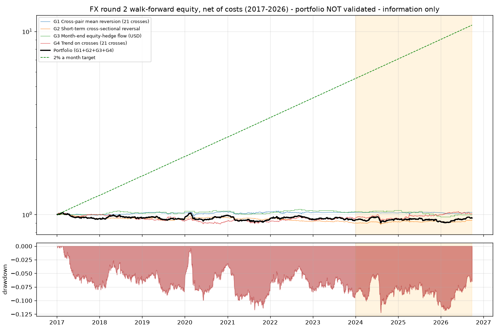
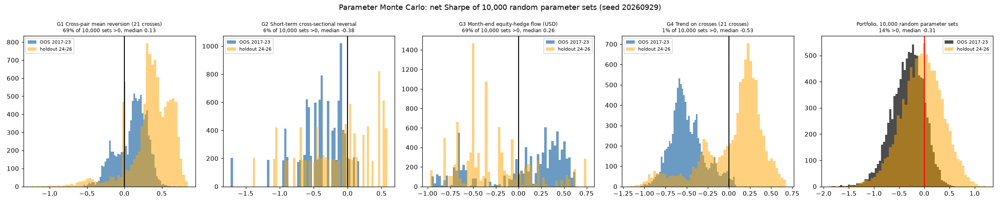
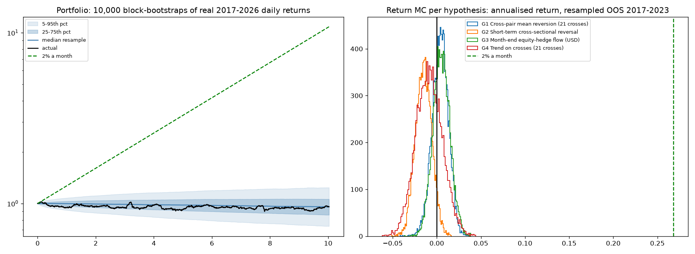

# FX round 2: results against the 2% a month target

**Verdict: none of the four new hypotheses validates, and none comes anywhere near 2% a month.** Two ideas show a
faint real signal out of sample: cross-pair mean reversion (G1) and the month-end equity-hedge flow (G3). At the
most leverage that keeps the out-of-sample drawdown to 20%, they would have made roughly **0.09% and 0.14% a
month**. The target is 2%.

- **Data:** TradeStation daily bars for the 7 USD majors and SPY, 2006-10 .. 2026-09-25. The 21 crosses are
  computed exactly from the real USD legs; for example EURJPY rebuilt this way matches EURUSD x USDJPY exactly.
- **Rules:** fixed in `edge/fx2/PREREGISTRATION.md` (commit `c8d7427`) before any test was run.
- **Reproduce:** `python -m edge.fx2.research` (about 4 minutes). It writes `edge/fx2/results/`.
- **Random numbers** (seed 20260929) are used only to pick the 10,000 parameter sets and to block-resample real
  returns. No prices or returns are generated.

## Results

All figures are net of costs. Cross costs are the sum of both legs' costs, which is deliberately conservative
(about 5 pips round turn on EURJPY). Signals are computed on the close and filled at the next open, with every
position sized to 10% volatility.

| id | hypothesis | WF OOS 2017-23 Sharpe / per year | param MC: sets > 0 (median) | P(loss), return MC | dev 2008-16 Sharpe | holdout* Sharpe | per month at 20% max DD | result |
|---|---|---|---|---|---|---|---|---|
| G1 | Cross-pair mean reversion (21 crosses) | 0.16 / +0.37% | 69% (+0.13) | 32% | -0.12 | +0.03 | +0.09% | **FAIL** (c1, c3, c4) |
| G2 | Short-term cross-sectional reversal | -0.58 / -1.47% | 6% (-0.38) | 95% | +0.16 | +0.52 | n/a (loses) | **FAIL** (c1, c2, c3) |
| G3 | Month-end equity-hedge flow (USD) | 0.20 / +0.51% | 69% (+0.26) | 29% | +0.65 | -0.46 | +0.14% | **FAIL** (c1, c3) |
| G4 | Trend on crosses (21 crosses) | -0.13 / -0.65% | 1% (-0.53) | 72% | +0.31 | +0.44 | n/a (loses) | **FAIL** (c1, c2, c3) |

\* The holdout is "seen-adjacent" (see the pre-registration), so it cannot validate anything on its own.

**The 2% a month test (criterion 5).** No strategy came close:

- G1 and G3 would need **more than 50x leverage** to reach 26.8% a year. At that leverage the out-of-sample
  drawdown is about **-99.9%**.
- G2 and G4 lost money, so no amount of leverage helps.

### What is worth knowing

- **G3, the month-end flow, is the most interesting idea here**, but it is fading:
  - Development 2008-2016: Sharpe 0.65, and **100% of the 10,000 parameter sets were positive**.
  - 2017-2023: Sharpe 0.20, with 69% of sets positive.
  - 2024-26: negative.

  This pattern (strong, then weaker, then gone) is typical of a published flow effect being arbitraged away. It
  is also tiny: it trades only a few days a month.
- **G1, cross-pair mean reversion,** was positive for 69% of parameter sets in 2017-23 and for 88% in 2024-26.
  But it was negative in 2008-16, and it makes less than 0.5% a year before leverage. The walk-forward almost
  always picked the slowest, most extreme setting (n 60, k 2.5-3.0), which means it hardly trades.
- **G2 and G4 are clear failures.** G4 (trend on crosses) repeats round 1: it worked before 2017 and not after.

## Portfolio (all four, equal risk; NOT validated, information only)

The green dashed line is the 2% a month target, for comparison.

| period | per year | per month | Sharpe | max drawdown |
|---|---|---|---|---|
| OOS 2017-2023 | -1.0% | -0.08% | -0.19 | -11.7% |
| Holdout 2024 .. 2026-09 | +0.9% | +0.08% | +0.23 | -7.6% |
| 2017 .. 2026-09 combined | -0.4% | -0.04% | -0.07 | -12.2% |

- **Parameter Monte Carlo, portfolio.** Of 10,000 random-parameter portfolios, only 14% had a positive
  out-of-sample Sharpe; the median was -0.31.
- **Return Monte Carlo, portfolio.** Across 10,000 block-bootstraps of the real 2017-2026 returns, the
  probability of a loss is 61%. The 5th to 95th percentile range is -3.0% to +2.2% a year.

## Limitations
- **No carry or rate data.** Swap is a sensitivity only.
- **Daily bars only.** Intraday effects cannot be tested with this data.
- **Cross costs are conservative.** If direct cross quotes cost half as much, G1 improves slightly. Even so, it
  cannot close a 20x gap to the target.
- **The G3 exit** happens at the open after the month-end close (next-open fills), not at the month-end close
  itself.

## Bottom line

Across two rounds, nine FX strategy families were pre-registered and tested on 20 years of real TradeStation
data with realistic costs. Nothing validated. The best out-of-sample FX signals found make well under 1% a year
before leverage.

**2% a month (26.8% a year) is not supported by any evidence found here.** Chasing it with leverage on these
signals would have wiped out the account.
