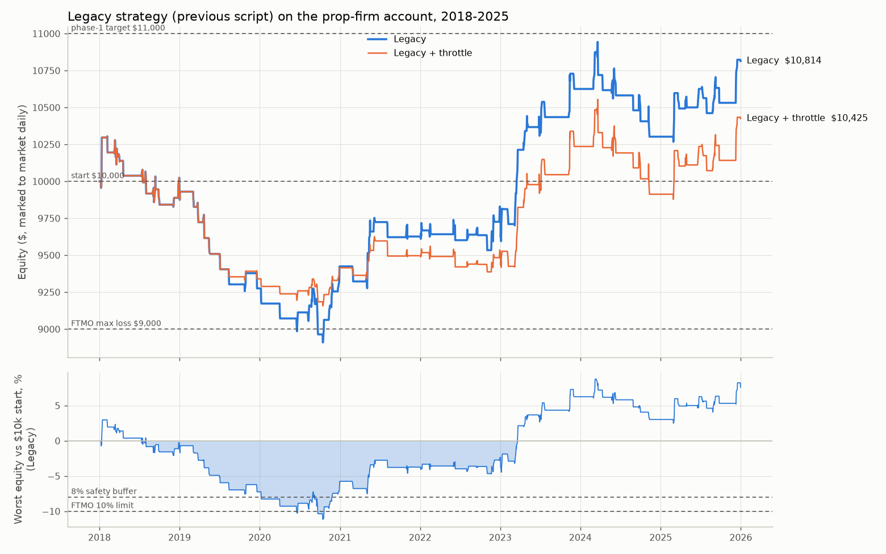
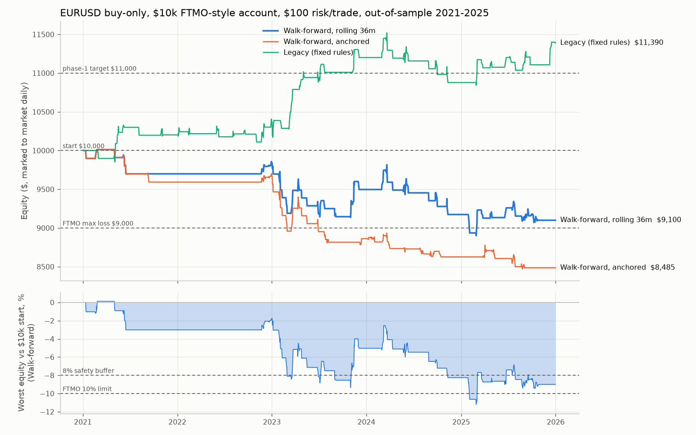
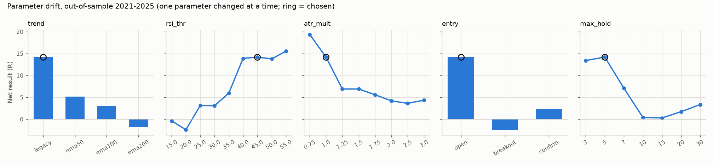
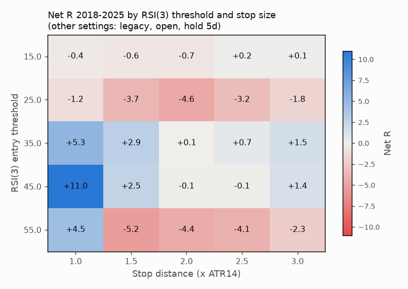

# EURUSD buy-only swing strategy: research report

*Generated by `python -m fxbot.research`. Every number below is computed from real TradeStation EURUSD daily bars (2108 bars, 2017-11-21 to 2025-12-31); no random numbers, no synthetic prices. Re-running regenerates the whole report.*

## Trading plan and standards

- Account: $10,000 FTMO-style (or similar prop firm). Risk per trade $100 (a $1,000 position budget with a 10% max loss = 1% of the account).
- Prop-firm limits: equity may never touch $9,000 (10% max loss) or fall $500 below the day's starting balance (5% daily loss). Checked against the worst intraday price every day, including open trades.
- Buy only, 1:3 risk:reward on every trade, one position at a time (never more than one new trade a day).
- Costs: 1.5 pip spread+slippage, $7/lot round-turn commission, -6 USD/lot per night held (long EURUSD swap is negative; set yours with `--swap`).
- Timeframes: 1D for trend and setup, 1H for confirmation. **No 1H data was available** (TradeStation's API serves intraday data only as 5-minute bars, 100 per call, and other data vendors are blocked here). The 1H confirmation is implemented (`entry='h1'`) and joins the optimisation as soon as an H1 file is passed with `--h1`; until then the daily `confirm` entry (buy the close of an up day after the pullback) stands in for it.
- Standards every run is checked against: no FTMO breach; max drawdown <= 8%; expectancy > 0; profit factor >= 1.3; rising, smooth equity (K-ratio > 0, R^2 >= 0.6).

## Summary

- **Out of sample (2021-2025), runs meeting all 5 standards:** Legacy (fixed rules), Legacy (fixed rules) + throttle.
- **Walk-forward, rolling 36m:** -9.0% out of sample, walk-forward efficiency -94%, 7 different parameter sets in 10 windows: the optimised settings did not carry forward.
- **Walk-forward, anchored:** -15.2% out of sample, walk-forward efficiency below -100%, 7 different parameter sets in 10 windows: the optimised settings did not carry forward.
- **Legacy (fixed rules), starts from 2018:** 52 passed, 11 failed, 33 still running of 96 monthly challenge starts; median 882 days to +10%.
- **Legacy + throttle, starts from 2018:** 46 passed, 0 failed, 50 still running of 96 monthly challenge starts; median 865 days to +10%.
- **Robustness:** the most-chosen settings make +11.0R over 2018-2025 while their neighbours average +2.0R: an isolated peak (fragile).
- **Pace:** at $100 risk per trade even the best run grows about 2.6% a year, so a +10% phase takes years, not weeks.

## 1. Baseline: the previous strategy on this account

Legacy rules: trend = EMA1 > EMA5 > EMA9 and RSI(14) > 50 on the prior day; buy the next open when RSI(3) < 40; stop 1x ATR(14), target 3R, exit after 5 days.

| Metric | Legacy 2018-2025 | Legacy + throttle (half risk below $9,500) |
|---|---|---|
| Period | 2018-01-02 -> 2025-12-31 | 2018-01-02 -> 2025-12-31 |
| Net profit | $814 | $425 |
| Return | +8.1% | +4.2% |
| CAGR | +0.98% | +0.52% |
| Trades | 82 | 82 |
| Trades / year | 10.3 | 10.3 |
| Win rate | 46.3% | 46.3% |
| Expectancy / trade | +0.099 R | +0.099 R |
| Profit factor | 1.22 | 1.13 |
| Max drawdown (intraday, from peak) | 14.22% | 11.61% |
| Lowest equity (FTMO floor $9,000) | $8,883 | $9,144 |
| Worst daily loss (limit $500) | $107 | $107 |
| FTMO limit breached | True | False |
| Max losing streak | 8 | 8 |
| Ulcer index | 6.44 | 6.62 |
| Longest time under water | 1899 days | 2105 days |
| Equity curve R^2 (smoothness) | 0.41 | 0.19 |
| K-ratio | 0.829 | 0.477 |
| Sharpe (daily MTM) | 0.27 | 0.17 |
| Sortino | 0.19 | 0.11 |
| Positive months | 31% | 31% |
| Time in market | 15% | 15% |
| Commission + swap paid | $343 | $284 |

**The legacy strategy would have lost an FTMO account started in 2018** (equity touched the floor on 2020-06-18). With the throttle it survived.

## 2. Inefficiencies found

| exit | trades | avg R | avg best R reached | avg days |
|---|---|---|---|---|
| TIME | 44 | 0.60 | 1.39 | 5.00 |
| STOP | 32 | -1.03 | 0.38 | 2.44 |
| TARGET | 5 | 2.95 | 3.00 | 4.60 |
| END | 1 | -0.09 | 0.20 | 1.00 |

1. **The 3R target does not fit a 5-day hold.** 54% of trades end on the time limit; only 6% ever reach +3R while 44% reach +1R. 16% of time-exited trades were up 1R+ and gave most of it back.
2. **Buying the falling knife.** 62% of stopped trades were stopped within 2 days: the entry is the next open after a weak close, with no sign the dip has ended.
3. **Redundant trend filter.** EMA1>EMA5 and RSI(14)>50 agree on 75% of days, EMA1>EMA5 and EMA5>EMA9 on 75%: three indicators, mostly one signal. It flips 40 times a year (vs 8/year for 'close above a rising EMA100'), so it is really a short-term momentum filter, not a trend filter. Note that out of sample it beat the slower EMA filters (section 6): the redundancy is a simplification opportunity, not proof the filter is bad.
4. **A confirmation that almost never fires.** Buying a break of the pullback day's high sounds sensible, but the pullback days are sharp down days that close near their lows: after a legacy signal EURUSD traded above that high the next day only 6% of the time (vs 49% on an average day). The daily `confirm` entry (buy the close of the next up day) was added so the optimiser has a working confirmation option.
5. **Costs.** Commission and swap equal 7% of gross winning P&L (swap $-266); longer holds pay more swap.
6. **Daily-bar blind spot.** 0 legacy trades hit stop and target on the same day (scored as losses); 1H data resolves these.

Does each trend filter pick days when EURUSD drifts up? (average move over the next 10 days, pips):

| trend | % of days on | next 10d when on | next 10d when off |
|---|---|---|---|
| legacy | 33.0 | 3.1 | -1.5 |
| ema50 | 40.0 | 5.6 | -3.7 |
| ema100 | 39.4 | 3.2 | -2.0 |
| ema200 | 40.4 | 9.4 | -6.3 |
| all days | 100.0 | 0.0 |  |

## 3. Walk-forward optimisation

- 324 parameter sets: trend filter x RSI(3) threshold x stop size x entry confirmation x max hold (risk:reward fixed at 1:3).
- Train on past data, trade the next 6 months untouched, roll forward. Rolling = fixed 36-month training window; anchored = training always starts 2018-01 and grows. Out-of-sample period 2021-01-01 to 2025-12-31.
- Objective: net R / max drawdown R; sets with < 12 trades or a 8%+ drawdown in training are rejected. Selection uses a **plateau score** (the set averaged with its grid neighbours), so a lucky isolated peak loses to a stable region. If nothing passes, the bot stays flat.

### Walk-forward, rolling 36m

| train | test | chosen parameters | sets passing | train R/yr | test R | test trades |
|---|---|---|---|---|---|---|
| 2018-01 .. 2020-12 | 2021-01 .. 2021-06 | ema50 | RSI3<25 | SL 1xATR | confirm | hold 5d | 1:3 | 117 | 2.3 | -3.0 | 5 |
| 2018-07 .. 2021-06 | 2021-07 .. 2021-12 | ema100 | RSI3<45 | SL 1.5xATR | confirm | hold 5d | 1:3 | 148 | -0.5 | 0.0 | 0 |
| 2019-01 .. 2021-12 | 2022-01 .. 2022-06 | ema100 | RSI3<25 | SL 2xATR | open | hold 5d | 1:3 | 139 | -0.3 | 0.0 | 0 |
| 2019-07 .. 2022-06 | 2022-07 .. 2022-12 | ema100 | RSI3<45 | SL 2xATR | open | hold 5d | 1:3 | 140 | -1.0 | 1.6 | 4 |
| 2020-01 .. 2022-12 | 2023-01 .. 2023-06 | ema100 | RSI3<45 | SL 1xATR | breakout | hold 5d | 1:3 | 158 | 0.8 | -6.1 | 11 |
| 2020-07 .. 2023-06 | 2023-07 .. 2023-12 | legacy | RSI3<45 | SL 1xATR | open | hold 5d | 1:3 | 167 | 4.1 | 3.1 | 6 |
| 2021-01 .. 2023-12 | 2024-01 .. 2024-06 | legacy | RSI3<45 | SL 1xATR | open | hold 5d | 1:3 | 137 | 4.4 | -0.4 | 7 |
| 2021-07 .. 2024-06 | 2024-07 .. 2024-12 | legacy | RSI3<45 | SL 1xATR | open | hold 5d | 1:3 | 149 | 3.5 | -2.8 | 4 |
| 2022-01 .. 2024-12 | 2025-01 .. 2025-06 | legacy | RSI3<45 | SL 1xATR | open | hold 5d | 1:3 | 145 | 3.3 | 0.9 | 5 |
| 2022-07 .. 2025-06 | 2025-07 .. 2025-12 | ema50 | RSI3<25 | SL 2xATR | confirm | hold 20d | 1:3 | 142 | 1.4 | -1.6 | 3 |

Walk-forward efficiency (out-of-sample R/yr vs training R/yr): -94%. Above ~50% suggests a real edge; near or below 0% means the training results did not carry forward.

Distinct parameter sets chosen across 10 windows: 7.

### Walk-forward, anchored

| train | test | chosen parameters | sets passing | train R/yr | test R | test trades |
|---|---|---|---|---|---|---|
| 2018-01 .. 2020-12 | 2021-01 .. 2021-06 | ema50 | RSI3<25 | SL 1xATR | confirm | hold 5d | 1:3 | 117 | 2.3 | -3.0 | 5 |
| 2018-01 .. 2021-06 | 2021-07 .. 2021-12 | ema50 | RSI3<25 | SL 1xATR | open | hold 5d | 1:3 | 145 | 1.3 | -1.1 | 1 |
| 2018-01 .. 2021-12 | 2022-01 .. 2022-06 | ema100 | RSI3<45 | SL 1.5xATR | confirm | hold 5d | 1:3 | 138 | -0.6 | 0.0 | 0 |
| 2018-01 .. 2022-06 | 2022-07 .. 2022-12 | ema100 | RSI3<45 | SL 1.5xATR | confirm | hold 5d | 1:3 | 129 | -0.5 | 1.1 | 4 |
| 2018-01 .. 2022-12 | 2023-01 .. 2023-06 | ema100 | RSI3<45 | SL 1xATR | breakout | hold 5d | 1:3 | 138 | 0.5 | -6.1 | 11 |
| 2018-01 .. 2023-06 | 2023-07 .. 2023-12 | ema100 | RSI3<45 | SL 2xATR | breakout | hold 5d | 1:3 | 126 | 0.0 | -0.9 | 3 |
| 2018-01 .. 2023-12 | 2024-01 .. 2024-06 | ema100 | RSI3<35 | SL 2xATR | confirm | hold 5d | 1:3 | 115 | -0.2 | -1.3 | 7 |
| 2018-01 .. 2024-06 | 2024-07 .. 2024-12 | ema100 | RSI3<35 | SL 2xATR | confirm | hold 5d | 1:3 | 97 | -0.4 | -1.0 | 5 |
| 2018-01 .. 2024-12 | 2025-01 .. 2025-06 | ema50 | RSI3<25 | SL 2xATR | breakout | hold 10d | 1:3 | 82 | -0.5 | -0.2 | 2 |
| 2018-01 .. 2025-06 | 2025-07 .. 2025-12 | ema50 | RSI3<25 | SL 2xATR | breakout | hold 10d | 1:3 | 83 | -0.5 | -1.2 | 2 |

Walk-forward efficiency (out-of-sample R/yr vs training R/yr): below -100%. Above ~50% suggests a real edge; near or below 0% means the training results did not carry forward.

Distinct parameter sets chosen across 10 windows: 7.

## 4. Out-of-sample comparison against the standards

| run | return | trades | expectancy R | profit factor | max DD | lowest equity | K-ratio | R^2 | standards met | missed |
|---|---|---|---|---|---|---|---|---|---|---|
| Legacy (fixed rules) | +13.9% | 49 | 0.28 | 1.71 | 7.0% | $9,824 | 1.82 | 0.77 | 5/5 | none |
| Legacy (fixed rules) + throttle | +13.9% | 49 | 0.28 | 1.71 | 7.0% | $9,824 | 1.82 | 0.77 | 5/5 | none |
| Walk-forward, rolling 36m | -9.0% | 45 | -0.20 | 0.69 | 11.3% | $8,881 | -1.77 | 0.76 | 0/5 | no FTMO breach; max drawdown <= 8%; expectancy > 0; profit factor >= 1.3; rising, smooth equity (K-ratio > 0, R^2 >= 0.6) |
| Walk-forward, rolling 36m + throttle | -8.3% | 45 | -0.20 | 0.57 | 9.6% | $9,058 | -2.72 | 0.88 | 1/5 | max drawdown <= 8%; expectancy > 0; profit factor >= 1.3; rising, smooth equity (K-ratio > 0, R^2 >= 0.6) |
| Walk-forward, anchored | -15.2% | 40 | -0.38 | 0.34 | 15.7% | $8,442 | -3.51 | 0.92 | 0/5 | no FTMO breach; max drawdown <= 8%; expectancy > 0; profit factor >= 1.3; rising, smooth equity (K-ratio > 0, R^2 >= 0.6) |
| Walk-forward, anchored + throttle | -10.2% | 40 | -0.38 | 0.32 | 10.6% | $8,954 | -3.00 | 0.90 | 0/5 | no FTMO breach; max drawdown <= 8%; expectancy > 0; profit factor >= 1.3; rising, smooth equity (K-ratio > 0, R^2 >= 0.6) |

| Metric | Walk-forward, rolling 36m | Legacy (fixed rules) |
|---|---|---|
| Period | 2021-01-04 -> 2025-12-31 | 2021-01-04 -> 2025-12-31 |
| Net profit | $-900 | $1,390 |
| Return | -9.0% | +13.9% |
| CAGR | -1.87% | +2.64% |
| Trades | 45 | 49 |
| Trades / year | 9.0 | 9.8 |
| Win rate | 35.6% | 53.1% |
| Expectancy / trade | -0.200 R | +0.284 R |
| Profit factor | 0.69 | 1.71 |
| Max drawdown (intraday, from peak) | 11.32% | 6.97% |
| Lowest equity (FTMO floor $9,000) | $8,881 | $9,824 |
| Worst daily loss (limit $500) | $238 | $104 |
| FTMO limit breached | True | False |
| Max losing streak | 7 | 4 |
| Ulcer index | 5.91 | 2.44 |
| Longest time under water | 1770 days | 650 days |
| Equity curve R^2 (smoothness) | 0.76 | 0.77 |
| K-ratio | -1.767 | 1.817 |
| Sharpe (daily MTM) | -0.45 | 0.73 |
| Sortino | -0.28 | 0.51 |
| Positive months | 22% | 35% |
| Time in market | 15% | 15% |
| Commission + swap paid | $183 | $207 |

Walk-forward, rolling 36m, return by year: 2021: -3.0%, 2022: +1.6%, 2023: -3.7%, 2024: -3.4%, 2025: -0.8%

Legacy (fixed rules), return by year: 2021: +2.0%, 2022: +2.0%, 2023: +7.6%, 2024: -2.9%, 2025: +4.7%

## 5. FTMO challenge simulation

A fresh $10,000 challenge started on the first trading day of every month, run until the +10% phase-1 target (pass), a limit breach (fail), or the end of the data (still running):

| strategy | starts | passed | failed | still running | pass rate (decided) | median days to pass |
|---|---|---|---|---|---|---|
| Legacy (fixed rules) | 60 | 27 | 0 | 33 | 100 | 653 |
| Walk-forward, rolling 36m | 60 | 0 | 6 | 54 | 0 |  |
| Walk-forward, anchored | 60 | 0 | 25 | 35 | 0 |  |
| Legacy (fixed rules), starts from 2018 | 96 | 52 | 11 | 33 | 83 | 882 |
| Legacy + throttle, starts from 2018 | 96 | 46 | 0 | 50 | 100 | 865 |

## 6. Parameter drift (robustness)

Centre = the set the rolling walk-forward chose most often: `legacy | RSI3<45 | SL 1xATR | open | hold 5d | 1:3`. Each panel changes one parameter, keeping the rest fixed. Robust settings sit on a broad plateau; a spike means luck.

In-sample (before the out-of-sample period) drift table

| param | value | net_r | trades | expectancy_r | profit_factor | max_dd_pct | breach |
|---|---|---|---|---|---|---|---|
| trend | legacy | -3.20 | 43 | -0.07 | 0.87 | 12.16 | False |
| trend | ema50 | -0.11 | 49 | -0.00 | 1.00 | 7.66 | False |
| trend | ema100 | -5.59 | 37 | -0.15 | 0.74 | 10.96 | True |
| trend | ema200 | -4.24 | 23 | -0.18 | 0.65 | 9.61 | False |
| rsi_thr | 15.00 | 0.00 | 0 | 0.00 | 0.00 | -0.00 | False |
| rsi_thr | 20.00 | -3.09 | 3 | -1.03 | 0.00 | 3.09 | False |
| rsi_thr | 25.00 | -4.32 | 6 | -0.72 | 0.17 | 6.07 | False |
| rsi_thr | 30.00 | -2.45 | 11 | -0.22 | 0.66 | 5.33 | False |
| rsi_thr | 35.00 | -0.64 | 19 | -0.03 | 0.94 | 7.18 | False |
| rsi_thr | 40.00 | -5.76 | 33 | -0.17 | 0.68 | 14.22 | True |
| rsi_thr | 45.00 | -3.20 | 43 | -0.07 | 0.87 | 12.16 | False |
| rsi_thr | 50.00 | -7.99 | 56 | -0.14 | 0.75 | 17.57 | True |
| rsi_thr | 55.00 | -11.02 | 62 | -0.18 | 0.70 | 22.70 | True |
| atr_mult | 0.75 | -4.95 | 44 | -0.11 | 0.83 | 15.17 | True |
| atr_mult | 1.00 | -3.20 | 43 | -0.07 | 0.87 | 12.16 | False |
| atr_mult | 1.25 | -4.02 | 42 | -0.10 | 0.80 | 12.23 | False |
| atr_mult | 1.50 | -4.41 | 42 | -0.10 | 0.76 | 11.41 | False |
| atr_mult | 1.75 | -4.17 | 42 | -0.10 | 0.73 | 9.74 | False |
| atr_mult | 2.00 | -4.30 | 42 | -0.10 | 0.70 | 9.11 | False |
| atr_mult | 2.50 | -3.73 | 42 | -0.09 | 0.68 | 7.58 | False |
| atr_mult | 3.00 | -3.01 | 42 | -0.07 | 0.69 | 6.22 | False |
| entry | open | -3.20 | 43 | -0.07 | 0.87 | 12.16 | False |
| entry | breakout | -3.10 | 3 | -1.03 | 0.00 | 3.62 | False |
| entry | confirm | -0.53 | 21 | -0.03 | 0.96 | 7.90 | False |
| max_hold | 3 | -9.92 | 45 | -0.22 | 0.55 | 14.33 | True |
| max_hold | 5 | -3.20 | 43 | -0.07 | 0.87 | 12.16 | False |
| max_hold | 7 | -5.04 | 39 | -0.13 | 0.79 | 16.40 | True |
| max_hold | 10 | -8.63 | 34 | -0.25 | 0.62 | 16.20 | True |
| max_hold | 15 | -6.81 | 33 | -0.21 | 0.72 | 16.10 | True |
| max_hold | 20 | -7.40 | 31 | -0.24 | 0.68 | 18.13 | True |
| max_hold | 30 | -5.80 | 30 | -0.19 | 0.75 | 19.07 | True |

Out-of-sample drift table

| param | value | net_r | trades | expectancy_r | profit_factor | max_dd_pct | breach |
|---|---|---|---|---|---|---|---|
| trend | legacy | 14.19 | 63 | 0.23 | 1.53 | 9.34 | False |
| trend | ema50 | 5.14 | 86 | 0.06 | 1.13 | 7.71 | False |
| trend | ema100 | 3.07 | 100 | 0.03 | 1.06 | 11.84 | False |
| trend | ema200 | -1.79 | 114 | -0.02 | 0.97 | 15.56 | True |
| rsi_thr | 15.00 | -0.37 | 2 | -0.19 | 0.63 | 1.30 | False |
| rsi_thr | 20.00 | -2.40 | 4 | -0.60 | 0.21 | 3.33 | False |
| rsi_thr | 25.00 | 3.14 | 15 | 0.21 | 1.39 | 3.42 | False |
| rsi_thr | 30.00 | 3.09 | 24 | 0.13 | 1.25 | 4.20 | False |
| rsi_thr | 35.00 | 5.96 | 38 | 0.16 | 1.36 | 5.21 | False |
| rsi_thr | 40.00 | 13.90 | 49 | 0.28 | 1.71 | 6.97 | False |
| rsi_thr | 45.00 | 14.19 | 63 | 0.23 | 1.53 | 9.34 | False |
| rsi_thr | 50.00 | 13.78 | 80 | 0.17 | 1.39 | 10.44 | False |
| rsi_thr | 55.00 | 15.54 | 94 | 0.17 | 1.35 | 6.92 | False |
| atr_mult | 0.75 | 19.38 | 63 | 0.31 | 1.61 | 6.56 | False |
| atr_mult | 1.00 | 14.19 | 63 | 0.23 | 1.53 | 9.34 | False |
| atr_mult | 1.25 | 6.91 | 62 | 0.11 | 1.29 | 8.76 | False |
| atr_mult | 1.50 | 6.91 | 62 | 0.11 | 1.34 | 8.34 | False |
| atr_mult | 1.75 | 5.60 | 62 | 0.09 | 1.31 | 7.13 | False |
| atr_mult | 2.00 | 4.20 | 62 | 0.07 | 1.25 | 6.42 | False |
| atr_mult | 2.50 | 3.64 | 62 | 0.06 | 1.28 | 5.23 | False |
| atr_mult | 3.00 | 4.36 | 62 | 0.07 | 1.46 | 4.15 | False |
| entry | open | 14.19 | 63 | 0.23 | 1.53 | 9.34 | False |
| entry | breakout | -2.50 | 7 | -0.36 | 0.51 | 6.01 | False |
| entry | confirm | 2.30 | 31 | 0.07 | 1.15 | 5.94 | False |
| max_hold | 3 | 13.42 | 66 | 0.20 | 1.57 | 4.56 | False |
| max_hold | 5 | 14.19 | 63 | 0.23 | 1.53 | 9.34 | False |
| max_hold | 7 | 7.09 | 55 | 0.13 | 1.24 | 9.56 | False |
| max_hold | 10 | 0.41 | 49 | 0.01 | 1.01 | 10.78 | False |
| max_hold | 15 | 0.29 | 45 | 0.01 | 1.01 | 11.75 | True |
| max_hold | 20 | 1.73 | 45 | 0.04 | 1.05 | 13.20 | True |
| max_hold | 30 | 3.35 | 45 | 0.07 | 1.10 | 13.20 | True |

Regime check: before 2021, 0 of 31 one-at-a-time variations were profitable; out of sample, 27 of 31 were. Results depend heavily on whether EURUSD is trending up.

## 7. Limitations

- Daily bars only: the intraday order of highs and lows is unknown. Same-day stop/target hits count as losses and breakout-day lows count against the trade, both conservative.
- Swap and commission are fixed assumptions; real long-EURUSD swap changed with interest rates.
- One instrument, one direction, a few dozen out-of-sample trades per run: small samples. Several variants were run (all shown above); picking the best-looking one after the fact is itself in-sample.
- A buy-only EURUSD strategy has little to do in long down-trends (2018, 2021-2022). Past behaviour does not guarantee future results.
