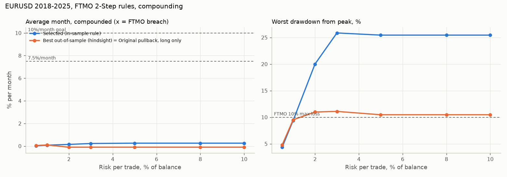
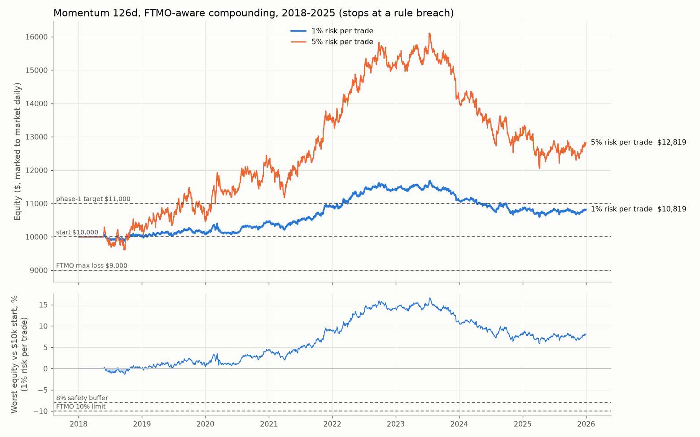

# EURUSD strategy for the FTMO 2-Step $10,000 Challenge: research report

*Generated by `python -m fxbot.ftmo_study` from real TradeStation EURUSD daily bars (2017-11 to 2025-12). No random numbers. Every table is recomputed on each run.*

## 1. FTMO rules implemented

| Rule | Value used | How it is simulated |
|---|---|---|
| Phase 1 (Challenge) target | 10% ($1,000) | pass when flat with balance >= $11,000 and >= 4 trading days |
| Phase 2 (Verification) target | 5% ($500) | fresh $10,000; pass at $10,500 and >= 4 trading days |
| Time limit | none | phases run until pass, breach or end of data |
| Max Loss | 10%, static | equity including open trades, at each day's worst price, must stay above $9,000 |
| Max Daily Loss | 5% ($500) | from the higher of balance and equity at the start of the day, incl. open losses, commission and swap |
| Minimum trading days | 4 per phase | a day with a new position; if the target is hit earlier the bot places micro trades on the remaining days |
| Account type | Swing | overnight and weekend holding allowed; forex leverage 1:30 (lot size capped) |
| Commission | $5/lot round turn | charged per trade |
| Spread + slippage | 1 pip | buys at the Ask, sells at the Bid |
| Swap | long -6, short +0 USD/lot/night | assumption: check the terminal's swap tab |
| Funded account | 80% split, payouts optional (first after 14 days), fee refunded with first payout | per your plan: **no withdrawals for 12 months**, profits compound |
| Scaling plan | +25% balance every 4 months | needs 10% growth **and 2 payouts** in 4 months, so it cannot trigger while not withdrawing |
| Forbidden practices | no latency/price-feed exploits, no hedging across accounts, no >2,000 server requests/day | a daily-bar swing bot is far from all of these |

Sources (FTMO's site is not reachable from the research environment, so the rules were cross-checked across these pages via search):

- [FTMO Trading Objectives](https://ftmo.com/en/trading-objectives/)
- [FTMO Academy: Maximum Daily Loss](https://academy.ftmo.com/lesson/maximum-daily-loss/)
- [FTMO FAQ: Swing account type](https://ftmo.com/en/faq/ftmo-swing-account-type/)
- [FTMO FAQ: closing positions overnight / weekend](https://ftmo.com/en/faq/do-i-have-to-close-my-positions-overnight-or-before-the-weekend/)
- [FTMO Forbidden Trading Practices](https://ftmo.com/en/forbidden-trading-practices/)
- [FTMO Scaling and Reward Growth Plan](https://ftmo.com/en/reward-growth-and-scaling-plan/)
- [FTMO FAQ: how do I withdraw my reward](https://ftmo.com/en/faq/how-do-i-withdraw-my-profits/)
- [FTMO Academy: Minimum Trading Days](https://academy.ftmo.com/lesson/minimum-trading-days/)
- [Propvator: FTMO commissions, spreads and swaps](https://propvator.com/blog/ftmo-trading-conditions/)
- [PropNavi: FTMO scaling plan explained](https://propnavi.io/en/blog/ftmo-scaling-plan-explained/)

## 2. Compounding and rule-aware position sizing

- Risk per trade = X% of the **current balance** (compounding; no withdrawals).
- Capped so a normal stop-out can never break a rule: never more than (balance - $9,000 - 1% buffer), and never more than what is left of today's $500 daily budget minus a 1% buffer. Only a price gap through the stop can breach.
- **Equity protector:** FTMO's daily loss counts floating profit given back (it is measured from the higher of balance and equity at the day's start). A swing trade that is +$800 in the morning and then stops out has lost $1,200 'today'. So every open trade is closed if today's loss reaches the $500 limit minus the 1% buffer.
- Lot size is also capped by the Swing account's 1:30 leverage and rounded down to 0.01 lot.
- The floor stays at $9,000 as the balance grows, so compounding widens the cushion: at $12,000 the account can absorb a $3,000 drawdown before touching the floor.

## 3. Can a daily EURUSD strategy earn 7-10% a month? What it would take

Required edge to average the target per month at 1:3 reward:risk (compounding):

| target / month | risk / trade | R needed / month | trades / month | expectancy needed (R) | win rate needed at 1:3 |
|---|---|---|---|---|---|
| 10% | 1% | 9.58 | 5 | 1.92 | 72.89 |
| 10% | 1% | 9.58 | 10 | 0.96 | 48.95 |
| 10% | 1% | 9.58 | 20 | 0.48 | 36.97 |
| 10% | 2% | 4.81 | 5 | 0.96 | 49.07 |
| 10% | 2% | 4.81 | 10 | 0.48 | 37.03 |
| 10% | 2% | 4.81 | 20 | 0.24 | 31.02 |
| 7.5% | 1% | 7.27 | 5 | 1.45 | 61.34 |
| 7.5% | 1% | 7.27 | 10 | 0.73 | 43.17 |
| 7.5% | 1% | 7.27 | 20 | 0.36 | 34.09 |
| 7.5% | 2% | 3.65 | 5 | 0.73 | 43.26 |
| 7.5% | 2% | 3.65 | 10 | 0.37 | 34.13 |
| 7.5% | 2% | 3.65 | 20 | 0.18 | 29.57 |

## 4. Strategy research

### 4a. Screen of 22 textbook systems

In-sample 2018-2021, out-of-sample 2022-2025. Results in R (multiples of the amount risked), before any FTMO caps. `path` assumes open-low-high-close on up days and open-high-low-close on down days; `worst` assumes the adverse extreme always comes first.

| system | IS trades | IS R | IS DD R | IS PF | OOS trades | OOS R | OOS DD R | OOS PF |
|---|---|---|---|---|---|---|---|---|
| Donchian 20 | long only | stop 2xATR | target 3R, max 60d | 18 | -5.78 | 5.84 | 0.57 | 23 | -5.44 | 10.43 | 0.70 |
| Donchian 20 | long only | stop 2xATR | trail 10d channel, max 120d | 22 | -8.78 | 8.85 | 0.35 | 27 | -4.36 | 9.09 | 0.68 |
| Donchian 55 | long only | stop 2xATR | target 3R, max 60d | 10 | -3.85 | 6.27 | 0.48 | 13 | -2.06 | 7.87 | 0.80 |
| Donchian 55 | long only | stop 2xATR | trail 27d channel, max 120d | 9 | -3.77 | 6.27 | 0.49 | 11 | -0.95 | 5.45 | 0.88 |
| Momentum 63d | long only | stop 3xATR | target 3R, exit on signal flip, max 60d | 38 | -2.59 | 3.56 | 0.68 | 38 | -0.40 | 4.20 | 0.97 |
| Momentum 63d | long only | stop 3xATR | exit on signal flip, max 250d | 35 | -2.63 | 3.56 | 0.60 | 31 | 0.41 | 4.18 | 1.05 |
| Momentum 126d | long only | stop 3xATR | target 3R, exit on signal flip, max 60d | 17 | 1.39 | 2.04 | 1.28 | 28 | -2.01 | 5.53 | 0.73 |
| Momentum 126d | long only | stop 3xATR | exit on signal flip, max 250d | 12 | 2.18 | 1.33 | 2.38 | 22 | -2.90 | 5.98 | 0.57 |
| Pullback RSI3 | long only | stop 1xATR | target 3R, max 5d | 47 | -3.15 | 9.47 | 0.88 | 53 | 14.39 | 8.01 | 1.64 |
| Vol breakout 0.5ATR | long only | stop 1xATR | target 3R, max 10d | 54 | -10.73 | 10.73 | 0.72 | 72 | -1.54 | 9.58 | 0.97 |
| Vol breakout 0.8ATR | long only | stop 1xATR | target 3R, max 10d | 39 | -14.90 | 14.90 | 0.50 | 54 | 2.40 | 11.24 | 1.07 |
| Donchian 20 | long + short | stop 2xATR | target 3R, max 60d | 34 | -5.43 | 12.53 | 0.77 | 37 | -6.87 | 14.26 | 0.76 |
| Donchian 20 | long + short | stop 2xATR | trail 10d channel, max 120d | 48 | -16.27 | 18.26 | 0.40 | 51 | -6.70 | 10.10 | 0.70 |
| Donchian 55 | long + short | stop 2xATR | target 3R, max 60d | 26 | -13.11 | 17.31 | 0.37 | 26 | -3.08 | 11.86 | 0.85 |
| Donchian 55 | long + short | stop 2xATR | trail 27d channel, max 120d | 23 | -11.18 | 17.02 | 0.42 | 22 | -1.02 | 8.18 | 0.94 |
| Momentum 63d | long + short | stop 3xATR | target 3R, exit on signal flip, max 60d | 63 | -1.36 | 6.25 | 0.91 | 56 | 1.47 | 5.37 | 1.10 |
| Momentum 63d | long + short | stop 3xATR | exit on signal flip, max 250d | 56 | -2.07 | 5.61 | 0.83 | 47 | 1.76 | 5.37 | 1.16 |
| Momentum 126d | long + short | stop 3xATR | target 3R, exit on signal flip, max 60d | 33 | 9.55 | 2.80 | 2.13 | 44 | -1.89 | 9.20 | 0.87 |
| Momentum 126d | long + short | stop 3xATR | exit on signal flip, max 250d | 19 | 8.09 | 1.45 | 3.73 | 33 | -2.63 | 10.44 | 0.77 |
| Pullback RSI3 | long + short | stop 1xATR | target 3R, max 5d | 88 | -0.67 | 11.14 | 0.99 | 101 | 6.32 | 6.62 | 1.13 |
| Vol breakout 0.5ATR | long + short | stop 1xATR | target 3R, max 10d | 131 | -20.55 | 23.20 | 0.77 | 143 | -3.36 | 13.02 | 0.96 |
| Vol breakout 0.8ATR | long + short | stop 1xATR | target 3R, max 10d | 89 | -14.76 | 21.52 | 0.75 | 111 | -1.26 | 19.80 | 0.98 |

**Systems profitable in both halves: 0 of 22.**

Same screen with the worst-case bar reading

| system | IS trades | IS R | IS DD R | IS PF | OOS trades | OOS R | OOS DD R | OOS PF |
|---|---|---|---|---|---|---|---|---|
| Donchian 20 | long only | stop 2xATR | target 3R, max 60d | 18 | -5.78 | 5.84 | 0.57 | 23 | -5.44 | 10.43 | 0.70 |
| Donchian 20 | long only | stop 2xATR | trail 10d channel, max 120d | 22 | -8.78 | 8.85 | 0.35 | 27 | -4.36 | 9.09 | 0.68 |
| Donchian 55 | long only | stop 2xATR | target 3R, max 60d | 10 | -3.85 | 6.27 | 0.48 | 13 | -2.04 | 6.86 | 0.80 |
| Donchian 55 | long only | stop 2xATR | trail 27d channel, max 120d | 9 | -3.77 | 6.27 | 0.49 | 12 | -2.18 | 6.08 | 0.76 |
| Momentum 63d | long only | stop 3xATR | target 3R, exit on signal flip, max 60d | 38 | -2.59 | 3.56 | 0.68 | 38 | -0.40 | 4.20 | 0.97 |
| Momentum 63d | long only | stop 3xATR | exit on signal flip, max 250d | 35 | -2.63 | 3.56 | 0.60 | 31 | 0.41 | 4.18 | 1.05 |
| Momentum 126d | long only | stop 3xATR | target 3R, exit on signal flip, max 60d | 17 | 1.39 | 2.04 | 1.28 | 28 | -2.01 | 5.53 | 0.73 |
| Momentum 126d | long only | stop 3xATR | exit on signal flip, max 250d | 12 | 2.18 | 1.33 | 2.38 | 22 | -2.90 | 5.98 | 0.57 |
| Pullback RSI3 | long only | stop 1xATR | target 3R, max 5d | 47 | -3.15 | 9.47 | 0.88 | 53 | 14.39 | 8.01 | 1.64 |
| Vol breakout 0.5ATR | long only | stop 1xATR | target 3R, max 10d | 58 | -18.67 | 18.67 | 0.57 | 74 | -2.92 | 9.52 | 0.94 |
| Vol breakout 0.8ATR | long only | stop 1xATR | target 3R, max 10d | 48 | -29.22 | 29.22 | 0.30 | 68 | -21.65 | 28.24 | 0.57 |
| Donchian 20 | long + short | stop 2xATR | target 3R, max 60d | 34 | -5.43 | 12.53 | 0.77 | 37 | -6.87 | 14.26 | 0.76 |
| Donchian 20 | long + short | stop 2xATR | trail 10d channel, max 120d | 48 | -16.27 | 18.26 | 0.40 | 52 | -8.55 | 11.68 | 0.64 |
| Donchian 55 | long + short | stop 2xATR | target 3R, max 60d | 26 | -13.11 | 17.31 | 0.37 | 26 | -3.06 | 11.86 | 0.85 |
| Donchian 55 | long + short | stop 2xATR | trail 27d channel, max 120d | 23 | -11.18 | 17.02 | 0.42 | 24 | -4.29 | 10.41 | 0.76 |
| Momentum 63d | long + short | stop 3xATR | target 3R, exit on signal flip, max 60d | 63 | -1.36 | 6.25 | 0.91 | 56 | 1.47 | 5.37 | 1.10 |
| Momentum 63d | long + short | stop 3xATR | exit on signal flip, max 250d | 56 | -2.07 | 5.61 | 0.83 | 47 | 1.76 | 5.37 | 1.16 |
| Momentum 126d | long + short | stop 3xATR | target 3R, exit on signal flip, max 60d | 33 | 9.55 | 2.80 | 2.13 | 44 | -1.89 | 9.20 | 0.87 |
| Momentum 126d | long + short | stop 3xATR | exit on signal flip, max 250d | 19 | 8.09 | 1.45 | 3.73 | 33 | -2.63 | 10.44 | 0.77 |
| Pullback RSI3 | long + short | stop 1xATR | target 3R, max 5d | 88 | -0.67 | 11.14 | 0.99 | 101 | 6.32 | 6.62 | 1.13 |
| Vol breakout 0.5ATR | long + short | stop 1xATR | target 3R, max 10d | 141 | -33.88 | 35.21 | 0.66 | 148 | -6.66 | 13.07 | 0.93 |
| Vol breakout 0.8ATR | long + short | stop 1xATR | target 3R, max 10d | 111 | -55.37 | 55.37 | 0.39 | 141 | -55.07 | 55.07 | 0.50 |

### 4b. Effect scan (average next-day and next-3-day move, pips, with t-statistics)

| condition | IS n | IS next1 pips | IS next1 t | OOS n | OOS next1 pips | OOS next1 t | IS next3 t | OOS next3 t |
|---|---|---|---|---|---|---|---|---|
| closed in bottom 20% of range | 246 | 2.0 | 0.8 | 227 | -1.2 | -0.3 | -0.2 | 1.4 |
| closed in top 20% of range | 212 | -4.4 | -1.3 | 238 | 0.5 | 0.1 | -1.9 | -0.6 |
| RSI(2) < 10 | 156 | 0.8 | 0.2 | 133 | 0.7 | 0.2 | 0.7 | 1.5 |
| RSI(2) > 90 | 131 | -6.5 | -1.5 | 130 | -7.8 | -1.6 | -1.6 | -2.0 |
| 3+ down closes | 130 | 2.5 | 0.6 | 125 | -0.3 | -0.1 | 0.4 | 2.3 |
| 3+ up closes | 131 | -2.1 | -0.5 | 125 | -4.1 | -0.9 | -0.8 | -1.0 |
| down > 1 ATR | 63 | -2.3 | -0.4 | 54 | -8.5 | -1.4 | -0.7 | 0.0 |
| up > 1 ATR | 51 | -4.9 | -0.7 | 56 | -4.5 | -0.5 | 0.2 | 0.0 |
| Friday (next = Monday) | 207 | 3.8 | 1.4 | 208 | 0.4 | 0.1 | -0.6 | 0.4 |
| last day of month | 48 | 3.2 | 0.4 | 48 | 0.9 | 0.1 | 0.0 | 0.4 |
| all days | 1038 | -0.7 | -0.5 | 1042 | 0.4 | 0.3 | -0.8 | 0.5 |

Effects significant (|t| >= 2) with the same sign in both halves: **none**.

### 4c. Selection (rule fixed in advance, in-sample only)

Rule: highest in-sample R / max drawdown R among systems with at least 30 trades and profit factor >= 1.2.

Selected: **Momentum 126d | long + short | stop 3xATR | target 3R, exit on signal flip, max 60d** (in-sample R/DD 3.41, PF 2.13, 33 trades). Out of sample it made **-1.9R** (profit factor 0.87).

For comparison the best out-of-sample system, picked with hindsight, was **Pullback RSI3 | long only | stop 1xATR | target 3R, max 5d**.

## 5. Risk frontier: monthly return vs FTMO breaches (2018-2025, compounding)

One continuous account from January 2018, run until a rule breach (then it stops, as FTMO would close it).

**Selected (in-sample rule): Momentum 126d | long + short | stop 3xATR | target 3R, exit on signal flip, max 60d**

| risk per trade | breached | months traded | final balance | avg month (compounded) | best month | worst month | months >= 7% | max drawdown % | trades |
|---|---|---|---|---|---|---|---|---|---|
| 0.5% | no | 96 | 10238.37 | 0.02 | 0.83 | -0.95 | 0 | 4.35 | 77 |
| 1% | no | 96 | 10818.59 | 0.08 | 2.34 | -1.99 | 0 | 9.36 | 77 |
| 2% | no | 96 | 11540.33 | 0.15 | 3.17 | -3.49 | 0 | 20.00 | 88 |
| 3% | no | 96 | 12480.83 | 0.23 | 4.97 | -5.30 | 0 | 25.85 | 115 |
| 5% | no | 96 | 12819.10 | 0.26 | 7.14 | -6.74 | 1 | 25.44 | 132 |
| 8% | no | 96 | 12819.10 | 0.26 | 7.14 | -6.74 | 1 | 25.44 | 132 |
| 10% | no | 96 | 12819.10 | 0.26 | 7.14 | -6.74 | 1 | 25.44 | 132 |

**Best out-of-sample (hindsight) = Original pullback, long only: Pullback RSI3 | long only | stop 1xATR | target 3R, max 5d**

| risk per trade | breached | months traded | final balance | avg month (compounded) | best month | worst month | months >= 7% | max drawdown % | trades |
|---|---|---|---|---|---|---|---|---|---|
| 0.5% | no | 96 | 10499.78 | 0.05 | 2.63 | -1.39 | 0 | 4.79 | 100 |
| 1% | no | 96 | 11057.91 | 0.10 | 5.46 | -2.95 | 0 | 9.51 | 100 |
| 2% | no | 96 | 9098.03 | -0.10 | 4.37 | -4.02 | 0 | 10.98 | 15 |
| 3% | no | 96 | 9097.59 | -0.10 | 4.39 | -6.06 | 0 | 11.09 | 14 |
| 5% | no | 96 | 9099.15 | -0.10 | 0.00 | -4.76 | 0 | 10.46 | 6 |
| 8% | no | 96 | 9099.15 | -0.10 | 0.00 | -4.76 | 0 | 10.46 | 6 |
| 10% | no | 96 | 9099.15 | -0.10 | 0.00 | -4.76 | 0 | 10.46 | 6 |

## 6. Full FTMO lifecycle simulation

A new Challenge started on the first trading day of every month (Jan 2018 to Nov 2025). Pass Phase 1 -> Phase 2 on a fresh $10,000 -> 12 funded months, no withdrawals.

**Selected (in-sample rule)**

| risk per trade | challenge starts | phase 1 passed | phase 1 failed | phase 2 passed | phase 2 failed | funded years completed | funded year survived | median funded 12m return % | median avg month (funded) % | median days to funded |
|---|---|---|---|---|---|---|---|---|---|---|
| 0.5% | 95 | 0 | 0 | 0 | 0 | 0 | 0 |  |  |  |
| 1% | 95 | 37 | 0 | 4 | 0 | 4 | 4 | -1.1 | -0.1 | 1505.5 |
| 2% | 95 | 51 | 0 | 41 | 0 | 41 | 41 | 8.1 | 0.6 | 810.0 |
| 3% | 95 | 53 | 0 | 50 | 0 | 50 | 50 | 13.5 | 1.0 | 596.5 |
| 5% | 95 | 54 | 0 | 45 | 0 | 45 | 45 | 14.0 | 0.9 | 482.0 |
| 8% | 95 | 54 | 0 | 45 | 0 | 45 | 45 | 14.0 | 0.9 | 482.0 |
| 10% | 95 | 54 | 0 | 45 | 0 | 45 | 45 | 14.0 | 0.9 | 482.0 |

**Best out-of-sample (hindsight) = Original pullback, long only**

| risk per trade | challenge starts | phase 1 passed | phase 1 failed | phase 2 passed | phase 2 failed | funded years completed | funded year survived | median funded 12m return % | median avg month (funded) % | median days to funded |
|---|---|---|---|---|---|---|---|---|---|---|
| 0.5% | 95 | 3 | 0 | 0 | 0 | 0 | 0 |  |  |  |
| 1% | 95 | 61 | 0 | 22 | 0 | 22 | 22 | -4.2 | -0.3 | 1249.0 |
| 2% | 95 | 45 | 0 | 40 | 0 | 40 | 40 | 10.5 | 0.8 | 523.5 |
| 3% | 95 | 49 | 14 | 34 | 6 | 34 | 34 | 15.9 | 1.1 | 461.5 |
| 5% | 95 | 36 | 7 | 22 | 0 | 22 | 22 | 30.7 | 2.1 | 297.0 |
| 8% | 95 | 36 | 7 | 22 | 0 | 22 | 22 | 30.7 | 2.1 | 297.0 |
| 10% | 95 | 36 | 7 | 22 | 0 | 22 | 22 | 30.7 | 2.1 | 297.0 |

## 7. Conclusions

- Highest average month achieved by any system at any risk level: **0.26%**.
- Selected (in-sample rule): best average month without an FTMO breach over 2018-2025: **0.26%** (at 5% risk).
- Best out-of-sample (hindsight) = Original pullback, long only: best average month without an FTMO breach over 2018-2025: **0.10%** (at 1% risk).
- FTMO's 5% daily loss limit caps a single trade at about 4% risk (keeping a 1% buffer), so settings above 4% behave identically: the rules themselves stop you from sizing up further.
- Best median month in a funded year (lifecycle, any system, any risk): **2.08%**.
- 10% or 7-8% a month is **not supported by EURUSD daily data**: it needs roughly 10x the edge any tested system showed. With the caps and the equity protector no frontier run breached, but raising risk stops adding return once the daily-loss cap binds: the edge, not the sizing, is the limit.
- What would have to change to aim higher: intraday data (1H/5M entries and exits, many more trades), several uncorrelated pairs/instruments, and an edge validated out of sample before sizing up.

## 8. Limitations

- Daily bars: the order of highs and lows inside a day is assumed (see 4a for the worst-case reading).
- FTMO's day resets at midnight Prague; the data's day at 17:00 New York (1 hour apart).
- Swap is a fixed assumption; spread 1 pip; commission $5/lot. Real fills vary.
- Challenge starts overlap in time, so the lifecycle counts are not independent trials.